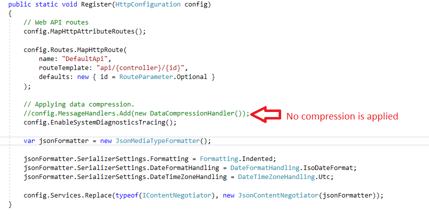
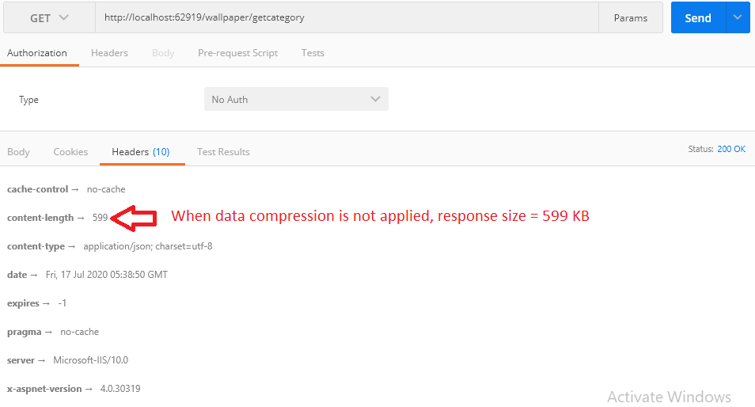
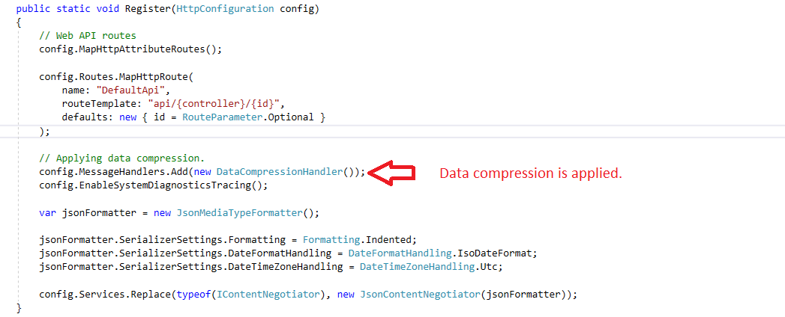
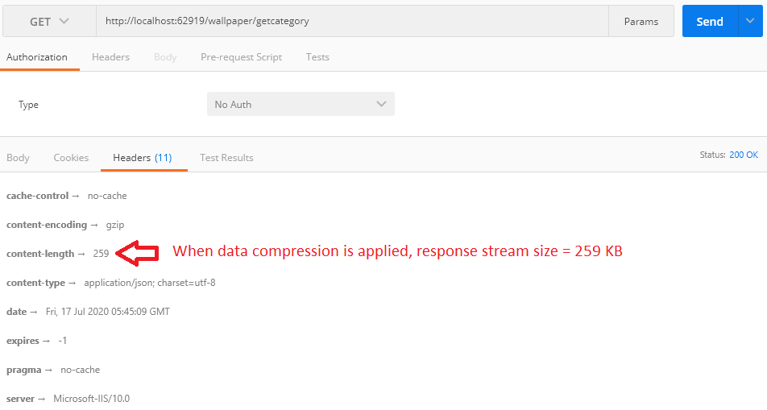

<h1>HTTP response sample data</h1>

<h1>Data compression is not applied</h1>

<h1>Response stream size when no compression is applied</h1>

<h1>Data compression is not applied</h1>

<h1>Response stream size when compression is applied</h1>

<h1>After applying data compression technique, size of http response data is reduced by 56.76%</h1>
